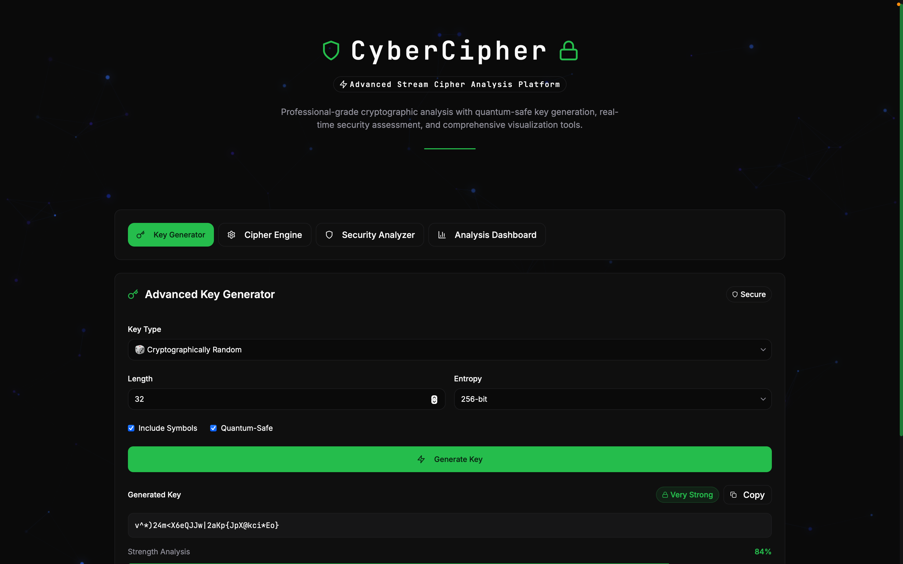
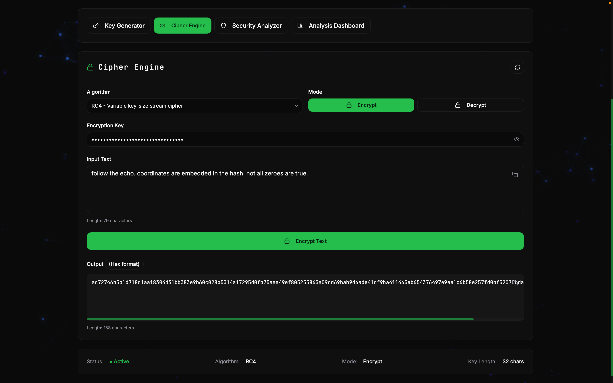
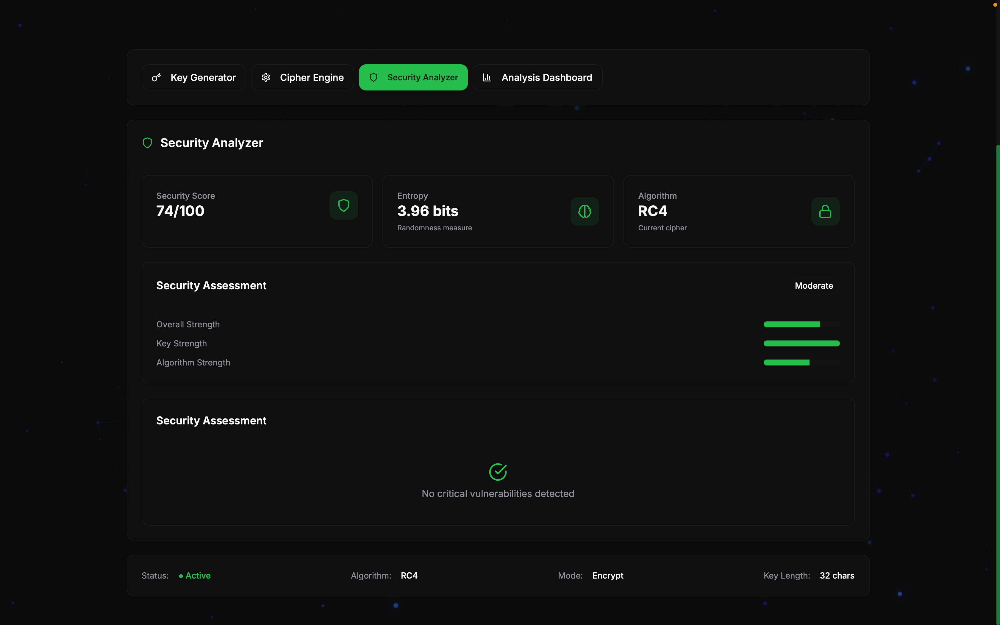
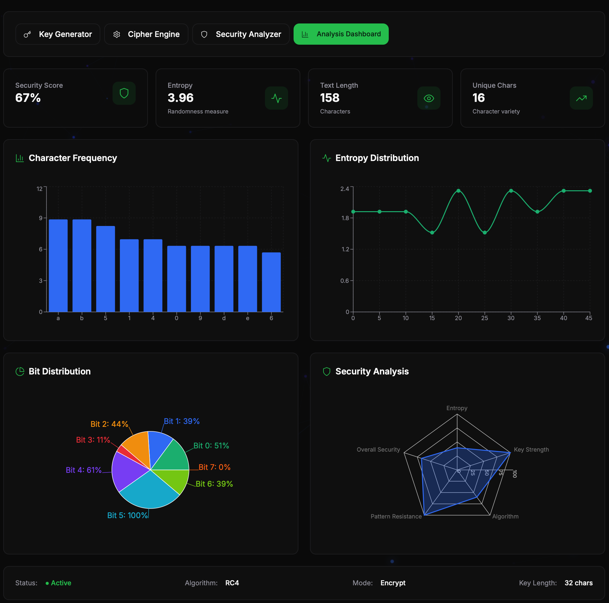

# 🔐 CyberCipher - Advanced Cryptographic Analysis- **🔑 Advanced Key Generation**: Cryptographically secure keys with multiple algorithms (Random, Quantum-Safe, Enhanced)
- **⚡ Multi-Algorithm Cipher Engine**: RC4 and ChaCha20 stream ciphers with real-time processing
- **🧠 Intelligent Security Analysis**: Context-aware vulnerability detection with Shannon entropy calculation
- **📊 Interactive Data Visualization**: Dynamic charts for frequency analysis, bit distribution, and security metrics
- **🎨 Modern UI/UX**: Professional dashboard with dark/light themes and responsive design
- **🔬 Educational Tools**: Comprehensive cryptographic learning and algorithm comparison features
- **🌐 Professional API**: RESTful backend for integration with external systemsrm

> **A comprehensive cryptographic analysis and visualization platform combining modern web technologies with advanced security analysis capabilities for professionals, researchers, and educators.**

🌐 **[Live Demo on Vercel →](https://cyber-cypher.vercel.app/)**

[](https://reactjs.org/)
[](https://www.typescriptlang.org/)
[](https://fastapi.tiangolo.com/)
[](https://vitejs.dev/)
[](https://tailwindcss.com/)
[](LICENSE)

---

## 📸 Screenshots

<div align="center">
  <table>
    <tr>
      <td width="50%">
        
        <p align="center"><em>Main Dashboard Interface</em></p>
      </td>
      <td width="50%">
        
        <p align="center"><em>Encryption/Decryption Engine</em></p>
      </td>
    </tr>
    <tr>
      <td width="50%">
        
        <p align="center"><em>Security Analyzer</em></p>
      </td>
      <td width="50%">
        
        <p align="center"><em>Interactive Analytics Dashboard</em></p>
      </td>
    </tr>
  </table>
</div>

---

## 🎯 Overview

CyberCipher is a state-of-the-art cryptographic analysis platform that bridges the gap between theoretical cryptography and practical security implementation. Built with React/TypeScript frontend and FastAPI backend, it provides real-time encryption/decryption, comprehensive security analysis, intelligent vulnerability detection, and interactive visualizations for understanding cipher behavior and security metrics.

### 🌟 Core Capabilities

- **🔑 Advanced Key Generation**: Cryptographically secure keys with multiple algorithms (Random, Quantum-Safe, Enhanced)
- **⚡ Multi-Algorithm Cipher Engine**: RC4 and ChaCha20 stream ciphers with real-time processing
- **🧠 AI-Powered Security Analysis**: Context-aware vulnerability detection with Shannon entropy calculation
- **📊 Interactive Data Visualization**: Dynamic charts for frequency analysis, bit distribution, and security metrics
- **� Modern UI/UX**: Professional dashboard with dark/light themes and responsive design
- **🔬 Educational Tools**: Comprehensive cryptographic learning and algorithm comparison features
- **🌐 Professional API**: RESTful backend for integration with external systems

---

## 📚 Documentation

For comprehensive technical details, implementation guides, and architecture documentation, please refer to:

**📖 [Technical Documentation](./TECHNICAL_DOCUMENTATION.md)**

The technical documentation includes:
- Detailed architecture analysis
- Algorithm implementations and security analysis
- API documentation and usage examples
- Performance benchmarks and optimization guides
- Security considerations and best practices
- Future enhancements and roadmap

---

## 🚀 Quick Start

### Prerequisites

- **Node.js** 18.2+ 
- **Python** 3.9+ (for backend API)
- **npm** or **yarn**
- **Git**

### 🔧 Installation & Setup

1. **Clone the Repository**
   ```bash
   git clone https://github.com/anirudh-tyagi/cyber-cypher.git
   cd cyber-cypher
   ```

2. **Frontend Setup**
   ```bash
   # Install Node.js dependencies
   npm install
   
   # Start development server
   npm run dev
   ```

3. **Backend Setup (Optional - for API features)**
   ```bash
   # Navigate to backend directory
   cd backend
   
   # Create and activate virtual environment
   python -m venv venv
   source venv/bin/activate  # On Windows: venv\Scripts\activate
   
   # Install Python dependencies
   pip install fastapi uvicorn python-multipart pydantic
   
   # Start backend server
   python main.py
   ```

4. **Access the Application**
   - **Frontend**: http://localhost:5173 (Vite dev server)
   - **Backend API**: http://localhost:8001 (if running)
   - **API Documentation**: http://localhost:8001/docs (if running)

---

## �️ Architecture & Project Structure

### 📁 Frontend Architecture (`/src`)

```
src/
├── components/                     # React Components
│   ├── 🎛️  Dashboard.tsx           # Main application dashboard
│   ├── 🔑 KeyGeneratorPanel.tsx    # Cryptographic key generation
│   ├── ⚙️  CipherEngine.tsx        # Encryption/decryption engine
│   ├── 🛡️  SecurityAnalyzer.tsx    # Security analysis & vulnerability detection
│   ├── 📊 AnalysisDashboard.tsx    # Data visualization dashboard
│   ├── 🎨 Header.tsx              # Application header & navigation
│   └── ui/                        # Reusable UI Components
│       ├── Alert.tsx              # Alert notifications
│       ├── Badge.tsx              # Status badges
│       ├── Button.tsx             # Interactive buttons
│       ├── Card.tsx               # Content containers
│       ├── DecryptedText.tsx      # Decrypted text display
│       ├── Input.tsx              # Form inputs
│       ├── ParticlesBackground.tsx # Animated background
│       ├── Progress.tsx           # Progress indicators
│       ├── Select.tsx             # Dropdown selectors
│       ├── StatCard.tsx           # Statistics cards
│       └── Tabs.tsx               # Tab navigation
├── services/                      # External Services
│   ├── 🌐 apiClient.ts            # Backend API communication
│   └── 🔍 aiSecurityAnalyzer.ts   # Security analysis service
├── types/                         # TypeScript Definitions
│   └── 📋 cipher.ts               # Cryptographic type definitions
└── utils/                         # Utility Functions
    ├── 🔐 cipherAlgorithms.ts     # RC4 & ChaCha20 implementations
    ├── 🧠 aiAnalysis.ts           # Statistical analysis utilities
    ├── 🔑 keyGeneration.ts        # Key generation algorithms
    └── 🔧 cn.ts                   # Utility functions
```

### 📁 Backend Architecture (`/backend`)

```
backend/
├── 📄 main.py                     # FastAPI application entry point
├── app/                           # Application modules
│   ├── core/                      # Core functionality
│   │   ├── config.py              # Configuration settings
│   │   └── security.py            # Security utilities
│   ├── models/                    # Data models
│   │   └── schemas.py             # Pydantic schemas
│   ├── routers/                   # API endpoints
│   │   ├── analysis.py            # Analysis endpoints
│   │   ├── cipher.py              # Cipher operations
│   │   ├── dashboard.py           # Dashboard data
│   │   └── keys.py                # Key generation endpoints
│   └── services/                  # Business logic
│       ├── analysis_service.py    # Analysis operations
│       ├── cipher_service.py      # Cipher implementations
│       └── key_service.py         # Key generation service
└── requirements.txt               # Python dependencies
```

### �️ Technology Stack

**Frontend:**
- **React 18.2** - Modern UI library with hooks
- **TypeScript 5.2** - Type-safe JavaScript development
- **Vite 4.5** - Fast build tool and dev server
- **Tailwind CSS 3.3** - Utility-first CSS framework
- **Framer Motion** - Animation library
- **Recharts** - Data visualization charts
- **Radix UI** - Accessible component primitives
- **Lucide React** - Beautiful icon library

**Backend:**
- **FastAPI** - Modern, high-performance Python web framework
- **Pydantic** - Data validation using Python type annotations
- **Uvicorn** - ASGI server for production deployment

**Development Tools:**
- **ESLint** - Code linting and quality assurance
- **PostCSS** - CSS processing and optimization
- **TypeScript Compiler** - Type checking and compilation

---

## 🎛️ Core Components & Features

### 1. 🔑 **Key Generator Panel**

**Advanced cryptographic key generation with multiple security levels:**

**Key Types Available:**
- **Random**: Standard cryptographically secure random keys
- **Quantum-Safe**: Post-quantum cryptography inspired keys using lattice-based transformations
- **Enhanced**: High-entropy keys with additional mathematical transformations

**Configuration Options:**
- **Length**: 8-512 characters (configurable)
- **Entropy Levels**: 128-bit, 256-bit, 512-bit security
- **Character Sets**: Alphanumeric, symbols, custom patterns
- **Real-time Strength Analysis**: Live security assessment
- **Hybrid Generation**: API-first with local crypto fallback

```typescript
// Example key generation with strength analysis
const generateSecureKey = async (options: KeyOptions) => {
  const key = await apiClient.generateKey(options)
  return {
    key: key.value,
    strength: analyzeKeyStrength(key.value),
    entropy: calculateEntropy(key.value),
    recommendations: getSecurityRecommendations(key.value)
  }
}
```

### 2. ⚙️ **Cipher Engine**

**Multi-algorithm encryption/decryption with real-time processing:**

**Supported Algorithms:**
- **RC4**: Variable key-size stream cipher
  - Legacy support for compatibility
  - Educational analysis of older algorithms
  - Vulnerability demonstration capabilities

- **ChaCha20**: Modern stream cipher by Daniel J. Bernstein
  - IETF standard (RFC 8439) compliant
  - Constant-time implementation
  - Superior security and performance
  - Recommended for production use

**Engine Features:**
- **Real-time Processing**: Instant encryption/decryption feedback
- **Algorithm Comparison**: Side-by-side security analysis
- **Input Validation**: Comprehensive error checking and sanitization
- **Output Formatting**: Hex encoding for binary data representation
- **Performance Metrics**: Speed and efficiency measurements

### 3. 🛡️ **Security Analyzer**

**Comprehensive security analysis with intelligent pattern recognition:**

**Analysis Capabilities:**
- **Shannon Entropy Calculation**: Information theory metrics for randomness
- **Pattern Detection**: Identification of repeating sequences and structures
- **Frequency Analysis**: Character and byte distribution analysis
- **Vulnerability Assessment**: Common cryptographic weakness detection
- **Intelligent Predictions**: Context-aware security recommendations

**Security Metrics:**
```typescript
interface SecurityAnalysis {
  entropy: number                    // Shannon entropy (0-8 bits)
  strength: {
    overall: number                  // Combined security score (0-100)
    keyStrength: number             // Key quality (35% weight)
    algorithmStrength: number       // Cipher security (25% weight)
    implementationStrength: number  // Code quality (25% weight)
    quantumResistance: number       // Post-quantum security (15% weight)
  }
  vulnerabilities: string[]          // Identified security weaknesses
  recommendations: string[]          // Actionable security improvements
  patterns: PatternAnalysis[]        // Detected patterns and anomalies
}
```

**Analysis Process:**
1. **Entropy Analysis**: Measures randomness and information content
2. **Pattern Detection**: Identifies repeating sequences and structures
3. **Statistical Analysis**: Character frequency and distribution
4. **Vulnerability Assessment**: Rule-based security weakness identification
5. **Recommendation Engine**: Actionable security improvements

### 4. 📊 **Analysis Dashboard**

**Interactive data visualization and comprehensive security metrics:**

#### **Visualization Components:**

**Character Frequency Analysis**
- **Type**: Interactive bar chart with hover details
- **Purpose**: Pattern identification and language detection
- **Features**: Real-time updates, theme-aware styling, export capabilities

**Entropy Distribution Visualization**
- **Type**: Dynamic line chart showing entropy variation
- **Purpose**: Randomness assessment across data segments
- **Features**: Trend analysis, weak spot identification, statistical overlays

**Bit Distribution Analysis**
- **Type**: Enhanced pie chart with external labels
- **Purpose**: Binary pattern analysis (Bit 0-7 distribution)
- **Features**: Byte-level randomness assessment, interactive legend

**Algorithm Security Comparison**
- **Type**: Multi-series radar chart
- **Purpose**: Comparative analysis of cipher algorithms
- **Metrics**: Security rating, performance, quantum resistance
- **Features**: Algorithm recommendation engine

**Security Metrics Overview**
- **Type**: Responsive stat cards grid
- **Metrics**: Overall score, entropy level, randomness index, vulnerability count
- **Features**: Color-coded indicators, trend visualization, alerts

---

## 🚀 Deployment & Production

### � **Frontend Deployment (Vercel)**

1. **Automatic Deployment**
   ```bash
   # Connect GitHub repository to Vercel
   # Automatic deployments on push to main branch
   ```

2. **Manual Deployment**
   ```bash
   # Install Vercel CLI
   npm i -g vercel
   
   # Deploy to production
   vercel --prod
   ```

3. **Environment Configuration**
   ```env
   # Add in Vercel Dashboard
   VITE_API_URL=https://your-backend-api.com
   NODE_ENV=production
   ```

### 🐳 **Backend Deployment Options**

**Railway (Recommended)**
```bash
# Install Railway CLI
npm install -g @railway/cli

# Deploy backend
cd backend
railway up
```

**Render**
- Connect GitHub repository
- Auto-deploy on git push
- Environment variables in dashboard

**Heroku**
```bash
# Create Heroku app
heroku create cybercypher-api

# Deploy
git subtree push --prefix backend heroku main
```

**DigitalOcean App Platform**
- Connect via GitHub integration
- Automatic builds and deployments

### 🔧 **Build Configuration**

**Frontend (vercel.json)**
```json
{
  "buildCommand": "npm run build",
  "outputDirectory": "dist",
  "framework": "vite",
  "rewrites": [
    { "source": "/(.*)", "destination": "/index.html" }
  ]
}
```

**Backend Requirements**
```txt
fastapi>=0.104.0
uvicorn[standard]>=0.24.0
python-multipart>=0.0.6
pydantic>=2.4.0
python-jose[cryptography]>=3.3.0
```

## 🛡️ Security Considerations

### � **Cryptographic Security**
- **Secure Random Generation**: Uses `crypto.getRandomValues()` and `secrets` module
- **Key Management**: No persistent storage of sensitive keys
- **Memory Safety**: Automatic cleanup of cryptographic materials
- **Algorithm Selection**: Modern algorithms (ChaCha20) recommended over legacy (RC4)

### 🌐 **Application Security**
- **Input Validation**: Comprehensive sanitization and validation
- **CORS Configuration**: Restricted origins for API access
- **Error Handling**: Secure error messages without information disclosure
- **Rate Limiting**: Protection against abuse (backend implementation recommended)

### 🔍 **Security Best Practices**
- **Client-side Processing**: Sensitive operations performed locally when possible
- **API Security**: Authentication and authorization for production deployments
- **Data Encryption**: TLS/HTTPS for all communications
- **Audit Logging**: Track security-relevant operations

---

## 📚 API Documentation

### 🔑 **Key Generation API**
```typescript
POST /api/keys/generate
{
  "length": 32,
  "key_type": "quantum-safe",
  "entropy": 256,
  "include_symbols": true
}

Response:
{
  "key": "A1B2C3D4E5F6...",
  "strength": 0.95,
  "length": 32,
  "key_type": "quantum-safe"
}
```

### 🔐 **Cipher Operations API**
```typescript
POST /api/cipher/encrypt
{
  "text": "Hello World",
  "key": "mySecretKey123",
  "algorithm": "chacha20"
}

Response:
{
  "result": "48656c6c6f20576f726c64",
  "algorithm": "chacha20",
  "success": true
}
```

### 📊 **Analysis API**
```typescript
POST /api/analysis/analyze
{
  "text": "encrypted_data_here",
  "analysis_type": "comprehensive"
}

Response:
{
  "entropy": 7.8,
  "strength": {
    "overall": 85,
    "keyStrength": 90,
    "algorithmStrength": 85
  },
  "vulnerabilities": [],
  "recommendations": ["Use longer keys", "Consider ChaCha20"]
}
```

## 🎓 Educational Use Cases

### 🏫 **Academic Applications**
- **Cryptography Courses**: Visual demonstration of encryption algorithms
- **Security Education**: Understanding vulnerability analysis
- **Research Projects**: Algorithm comparison and analysis
- **Cybersecurity Training**: Hands-on experience with modern tools

### 💼 **Professional Applications**
- **Security Auditing**: Cipher identification and analysis
- **Penetration Testing**: Cryptographic assessment tools
- **Development**: Integration testing for cryptographic implementations
- **Consulting**: Client demonstrations and security assessments

## 🤝 Contributing

We welcome contributions from the community! Here's how you can help:

### 🐛 **Bug Reports**
- Use GitHub Issues to report bugs
- Include steps to reproduce
- Provide system information and browser details

### ✨ **Feature Requests**
- Suggest new algorithms or analysis methods
- Propose UI/UX improvements
- Request educational features

### 🔧 **Development Contributions**
1. **Fork the repository**
2. **Create a feature branch**: `git checkout -b feature/amazing-feature`
3. **Commit changes**: `git commit -m 'Add amazing feature'`
4. **Push to branch**: `git push origin feature/amazing-feature`
5. **Open a Pull Request**

### 📝 **Code Standards**
- Follow TypeScript/ESLint configurations
- Write comprehensive tests for new features
- Update documentation for API changes
- Follow security best practices

## 🔮 Future Roadmap

### 🚀 **Upcoming Features**
- **Post-Quantum Cryptography**: Implementation of quantum-resistant algorithms
- **Advanced Pattern Recognition**: Enhanced statistical analysis methods
- **3D Visualizations**: Interactive security landscape mapping
- **Multi-Language Support**: Internationalization for global users
- **Enterprise Features**: SSO, RBAC, and audit logging

### 🔬 **Research Areas**
- **Quantum Cryptography**: Integration with quantum key distribution
- **Homomorphic Encryption**: Privacy-preserving computation analysis
- **Blockchain Integration**: Cryptocurrency and smart contract security
- **IoT Security**: Lightweight cryptography for embedded systems

## 📄 License

This project is licensed under the MIT License - see the [LICENSE](LICENSE) file for details.

## 🙏 Acknowledgments

- **Daniel J. Bernstein** - ChaCha20 algorithm design
- **Claude Shannon** - Information theory and entropy concepts
- **The Cryptography Community** - Continuous research and development
- **Open Source Contributors** - Libraries and tools that make this possible

## 📞 Contact & Support

- **GitHub Issues**: [Report bugs or request features](https://github.com/anirudh-tyagi/ai-cyber-cypher/issues)
- **Documentation**: [Technical Documentation](./TECHNICAL_DOCUMENTATION.md)
- **Live Demo**: [CyberCipher on Vercel](https://cyber-cypher.vercel.app/)

---

<div align="center">
  <p><strong>Built with ❤️ by security enthusiasts, for the cryptography community</strong></p>
  <p>⭐ Star this repository if you find it useful!</p>
</div>
