# Deep Dive: CyberCipher Architecture, Algorithms & Application

**Version**: 1.0  
**Date**: July 9, 2025  
**Author**: Anirudh Tyagi  

---

## Table of Contents

1. [Executive Summary](#executive-summary)
2. [Application Architecture](#application-architecture)
3. [Cryptographic Algorithms](#cryptographic-algorithms)
4. [Core Modules & Functions](#core-modules--functions)
5. [Security Analysis Engine](#security-analysis-engine)
6. [Data Flow & Processing](#data-flow--processing)
7. [Visualization & Analytics](#visualization--analytics)
8. [Mathematical Foundations](#mathematical-foundations)
9. [Real-World Applications](#real-world-applications)
10. [Security Considerations](#security-considerations)
11. [Performance Analysis](#performance-analysis)
12. [Future Enhancements](#future-enhancements)
13. [Conclusion](#conclusion)

---

## Executive Summary

**CyberCipher** is a comprehensive cryptographic analysis platform that combines modern web technologies with advanced cryptographic algorithms. Built using React/TypeScript frontend and FastAPI backend, it serves as both an educational tool and a professional-grade security analysis platform.

### Core Capabilities:
- **Multi-Algorithm Encryption/Decryption**: RC4, AES (simulated), XOR, and custom implementations
- **Advanced Key Generation**: Cryptographically secure random key generation with entropy analysis
- **Real-Time Security Analysis**: Shannon entropy calculation, pattern detection, vulnerability assessment
- **Interactive Visualizations**: Frequency analysis, bit distribution, security metrics dashboards
- **AI-Powered Insights**: Machine learning-inspired security predictions and recommendations

### Target Audience:
- **Security Professionals**: For cryptographic analysis and vulnerability assessment
- **Researchers**: For studying cipher behavior and security patterns
- **Developers**: For understanding cryptographic implementation best practices  
- **Students**: For learning cryptographic concepts through hands-on experience

---

## Application Architecture

### High-Level System Design

```mermaid
graph TB
    subgraph "🌐 CyberCipher Platform"
        subgraph "Frontend Layer (React/TypeScript)"
            KGP[🔑 Key Generator<br/>Panel]
            CE[⚙️ Cipher Engine]
            SA[🛡️ Security Analyzer]
            AD[📊 Analysis<br/>Dashboard]
            VD[📈 Visualization<br/>Dashboard] 
            DC[🎛️ Dashboard<br/>Controller]
        end
        
        subgraph "API Communication Layer"
            HTTP[🌐 HTTP/REST API<br/>JSON Communication]
        end
        
        subgraph "Backend Layer (FastAPI/Python)"
            KGS[🔑 Key Generation<br/>Services]
            CS[🔐 Cipher Services]
            AE[🧠 Analysis Engine]
            SU[🛡️ Security Utils]
            DM[📄 Data Models]
            EP[🚀 API Endpoints]
        end
    end
    
    KGP --> HTTP
    CE --> HTTP
    SA --> HTTP
    AD --> HTTP
    VD --> HTTP
    DC --> HTTP
    
    HTTP --> KGS
    HTTP --> CS
    HTTP --> AE
    HTTP --> SU
    HTTP --> DM
    HTTP --> EP
    
    style KGP fill:#e1f5fe
    style CE fill:#f3e5f5
    style SA fill:#e8f5e8
    style AD fill:#fff3e0
    style VD fill:#fce4ec
    style DC fill:#f1f8e9
    style HTTP fill:#e0f2f1
    style KGS fill:#fff8e1
    style CS fill:#e8eaf6
    style AE fill:#f0f4c3
    style SU fill:#fce4ec
    style DM fill:#e1f5fe
    style EP fill:#f3e5f5
```



**Alternative ASCII Architecture:**
```
┌─────────────────────────────────────────────────────────────────┐
│                     🌐 CyberCipher Platform                     │
├─────────────────────────────────────────────────────────────────┤
│  Frontend (React/TypeScript)                                   │
│  ┌─────────────────┐  ┌─────────────────┐  ┌─────────────────┐ │
│  │ 🔑 Key Generator │  │ ⚙️ Cipher Engine │  │🛡️Security Analyzer│ │
│  │     Panel       │  │                 │  │                 │ │
│  └─────────────────┘  └─────────────────┘  └─────────────────┘ │
│  ┌─────────────────┐  ┌─────────────────┐  ┌─────────────────┐ │
│  │ 📊 Analysis     │  │ 📈 Visualization │  │ 🎛️ Dashboard    │ │
│  │   Dashboard     │  │   Dashboard     │  │   Controller    │ │
│  └─────────────────┘  └─────────────────┘  └─────────────────┘ │
├─────────────────────────────────────────────────────────────────┤
│  🌐 API Communication Layer (HTTP/REST)                        │
├─────────────────────────────────────────────────────────────────┤
│  Backend (FastAPI/Python)                                      │
│  ┌─────────────────┐  ┌─────────────────┐  ┌─────────────────┐ │
│  │🔑 Key Generation │  │🔐 Cipher Services│  │🧠 Analysis Engine│ │
│  │   Services      │  │                 │  │                 │ │
│  └─────────────────┘  └─────────────────┘  └─────────────────┘ │
│  ┌─────────────────┐  ┌─────────────────┐  ┌─────────────────┐ │
│  │🛡️ Security Utils │  │ 📄 Data Models  │  │🚀 API Endpoints │ │
│  │                 │  │                 │  │                 │ │
│  └─────────────────┘  └─────────────────┘  └─────────────────┘ │
└─────────────────────────────────────────────────────────────────┘
```

### Technology Stack

**Frontend Technologies:**
- **React 18.x**: Component-based UI framework
- **TypeScript 5.x**: Type-safe JavaScript with enhanced IDE support
- **Tailwind CSS 3.x**: Utility-first CSS framework for styling
- **Framer Motion**: Animation library for smooth transitions
- **Recharts**: Chart library for data visualizations
- **Lucide React**: Icon library with consistent design

**Backend Technologies:**
- **FastAPI**: Modern Python web framework with automatic API documentation
- **Python 3.13**: Latest Python version with enhanced performance
- **Pydantic**: Data validation using Python type annotations
- **Uvicorn**: ASGI server for FastAPI applications

**Development Tools:**
- **Vite**: Fast build tool and development server
- **ESLint**: Code linting and style enforcement
- **npm**: Package manager and script runner

---

## Cryptographic Algorithms

### 1. RC4 Stream Cipher

**Algorithm Type**: Stream Cipher  
**Key Size**: Variable (typically 40-2048 bits)  
**Status**: **DEPRECATED** (RFC 7465)

#### Implementation Analysis:

```typescript
function rc4Encrypt(plaintext: string, key: string): string {
  // Key Scheduling Algorithm (KSA)
  const S = Array.from({length: 256}, (_, i) => i);
  let j = 0;
  
  for (let i = 0; i < 256; i++) {
    j = (j + S[i] + key.charCodeAt(i % key.length)) % 256;
    [S[i], S[j]] = [S[j], S[i]]; // Swap
  }
  
  // Pseudo-Random Generation Algorithm (PRGA)
  let i = 0, j = 0;
  let result = '';
  
  for (let k = 0; k < plaintext.length; k++) {
    i = (i + 1) % 256;
    j = (j + S[i]) % 256;
    [S[i], S[j]] = [S[j], S[i]]; // Swap
    
    const keystreamByte = S[(S[i] + S[j]) % 256];
    result += String.fromCharCode(
      plaintext.charCodeAt(k) ^ keystreamByte
    );
  }
  
  return result;
}
```

**Mathematical Foundation:**
- **KSA Formula**: `j = (j + S[i] + key[i mod keylength]) mod 256`
- **PRGA Formula**: `K = S[(S[i] + S[j]) mod 256]`
- **Encryption**: `C[k] = P[k] ⊕ K[k]`

**Security Analysis:**
- **Strengths**: Fast, simple implementation
- **Weaknesses**: Known vulnerabilities (bias in keystream, related-key attacks)
- **Real-World Status**: Disabled in major browsers, not recommended for new applications

### 2. AES (Advanced Encryption Standard) - Simulated

**Algorithm Type**: Block Cipher  
**Key Sizes**: 128, 192, 256 bits  
**Block Size**: 128 bits  
**Status**: **RECOMMENDED**

#### Simplified Implementation (Educational):

```typescript
function aesEncrypt(plaintext: string, key: string): string {
  // Simplified AES simulation for educational purposes
  // Real AES involves SubBytes, ShiftRows, MixColumns, AddRoundKey
  
  const rounds = key.length >= 32 ? 14 : (key.length >= 24 ? 12 : 10);
  let state = plaintext;
  
  for (let round = 0; round < rounds; round++) {
    // Simplified round function
    state = substitutionBox(state);
    state = shiftRows(state);
    if (round < rounds - 1) {
      state = mixColumns(state);
    }
    state = addRoundKey(state, deriveRoundKey(key, round));
  }
  
  return state;
}
```

**Mathematical Operations:**
- **SubBytes**: S-box substitution using Galois Field GF(2^8)
- **ShiftRows**: Cyclic shift of rows in state matrix
- **MixColumns**: Matrix multiplication in GF(2^8)
- **AddRoundKey**: XOR with round key

**Security Strength**: 95/100 in our rating system

### 3. XOR Cipher (Educational)

**Algorithm Type**: Stream Cipher  
**Key Size**: Variable  
**Status**: **EDUCATIONAL ONLY**

#### Implementation:

```typescript
function xorCipher(text: string, key: string): string {
  let result = '';
  for (let i = 0; i < text.length; i++) {
    const textChar = text.charCodeAt(i);
    const keyChar = key.charCodeAt(i % key.length);
    result += String.fromCharCode(textChar ^ keyChar);
  }
  return result;
}
```

**Mathematical Formula:**
- **Encryption**: `C[i] = P[i] ⊕ K[i mod |K|]`
- **Decryption**: `P[i] = C[i] ⊕ K[i mod |K|]` (identical operation)

**Security Analysis:**
- **Strength**: 10/100 (educational only)
- **Vulnerabilities**: Frequency analysis, known-plaintext attacks
- **Use Case**: Teaching cryptographic concepts

---

## Core Modules & Functions

### 1. Key Generation Module

#### Function: `generateLocalKey(options: KeyGenerationOptions)`

**Input Parameters:**
```typescript
interface KeyGenerationOptions {
  length: number;        // 8-512 characters
  type: 'random' | 'quantum' | 'neural';
  entropy: 128 | 256 | 512;  // bits
  includeSymbols: boolean;
  quantumSafe: boolean;
}
```

**Core Algorithm:**
```typescript
function generateLocalKey(options: KeyGenerationOptions): string {
  // Character sets based on options
  const charset = buildCharacterSet(options);
  
  // Use Web Crypto API for cryptographic randomness
  const randomValues = new Uint32Array(options.length);
  crypto.getRandomValues(randomValues);
  
  let key = '';
  for (let i = 0; i < options.length; i++) {
    const randomIndex = randomValues[i] % charset.length;
    key += charset[randomIndex];
  }
  
  return key;
}
```

**Output**: Cryptographically secure random key string

**Security Features:**
- Uses `crypto.getRandomValues()` for true randomness
- Entropy validation ensures sufficient unpredictability
- Character set customization for different security requirements

#### Function: `analyzeKeyStrength(key: string): number`

**Strength Scoring Algorithm (0-100 points):**

```typescript
function analyzeKeyStrength(key: string): number {
  let score = 0;
  
  // 1. Length Scoring (0-40 points)
  const lengthScore = calculateLengthScore(key.length);
  score += lengthScore;
  
  // 2. Character Variety (0-25 points)
  const varietyScore = calculateVarietyScore(key);
  score += varietyScore;
  
  // 3. Entropy Calculation (0-25 points)
  const entropyScore = calculateEntropyScore(key);
  score += entropyScore;
  
  // 4. Pattern Penalty (0-10 points deducted)
  const patternPenalty = detectPatterns(key);
  score -= patternPenalty;
  
  return Math.max(0, Math.min(100, Math.round(score)));
}
```

**Detailed Scoring Formulas:**

1. **Length Score:**
   ```
   if length >= 32: score = 40
   if length >= 24: score = 35
   if length >= 16: score = 25
   if length >= 12: score = 15
   if length >= 8:  score = 10
   else:            score = 5
   ```

2. **Character Variety Score:**
   ```
   hasLowercase:     +5 points
   hasUppercase:     +5 points
   hasNumbers:       +5 points
   hasSpecialChars:  +5 points
   hasComplexSymbols: +5 points
   Maximum: 25 points
   ```

3. **Entropy Score:**
   ```
   uniqueChars = |Set(key)|
   entropyRatio = uniqueChars / length
   entropyScore = min(25, entropyRatio * 50)
   ```

4. **Pattern Detection Penalties:**
   ```
   repeatedChars = count(/(.)\1{2,}/g)
   sequentialPatterns = count(/(abc|123|qwe|...)/gi)
   keyboardPatterns = count(/(qwerty|asdf|...)/gi)
   totalPenalty = (repeatedChars + sequentialPatterns + keyboardPatterns) * 2
   ```

### 2. Cipher Engine Module

#### Function: `encryptText(text: string, key: string, algorithm: string)`

**Process Flow:**
```
Input Text → Algorithm Selection → Encryption Process → Output Format
     ↓              ↓                    ↓               ↓
"Hello World"  →  "aes"  →  AES_Encrypt(text, key)  →  Hex String
```

**Implementation:**
```typescript
async function encryptText(text: string, key: string, algorithm: string): Promise<string> {
  // Input validation
  if (!text || !key) throw new Error('Invalid input');
  
  // Algorithm dispatch
  switch (algorithm.toLowerCase()) {
    case 'aes':
      return hexEncode(aesEncrypt(text, key));
    case 'rc4':
      return hexEncode(rc4Encrypt(text, key));
    case 'xor':
      return hexEncode(xorCipher(text, key));
    default:
      throw new Error('Unsupported algorithm');
  }
}
```

**Output Format**: Hexadecimal-encoded encrypted data for safe display

### 3. Security Analysis Engine

#### Function: `calculateEntropy(text: string): number`

**Shannon Entropy Formula:**
```
H(X) = -Σ P(xi) * log₂(P(xi))
```

**Implementation:**
```typescript
function calculateLocalEntropy(text: string): number {
  if (!text) return 0;
  
  // Calculate character frequencies
  const frequency: { [key: string]: number } = {};
  for (const char of text) {
    frequency[char] = (frequency[char] || 0) + 1;
  }
  
  // Calculate Shannon entropy
  let entropy = 0;
  const length = text.length;
  
  Object.values(frequency).forEach(count => {
    const probability = count / length;
    entropy -= probability * Math.log2(probability);
  });
  
  return Math.round(entropy * 100) / 100;
}
```

**Entropy Interpretation:**
- **0-2 bits**: Very low entropy, highly predictable
- **2-4 bits**: Low entropy, some patterns
- **4-6 bits**: Good entropy, acceptable randomness
- **6-8 bits**: High entropy, excellent randomness

#### Function: `calculateSecurityScore(cipherState: CipherState): SecurityStrength`

**Multi-Factor Security Assessment:**

```typescript
function calculateSecurityScore(state: CipherState): SecurityStrength {
  // Component scores (0-100 each)
  const keyStrength = analyzeKeyStrength(state.key);
  const algorithmStrength = getAlgorithmStrength(state.algorithm);
  const implementationStrength = 77; // Fixed for this implementation
  const quantumResistance = getQuantumResistance(state.algorithm);
  
  // Weighted overall score
  const overall = Math.round(
    keyStrength * 0.35 +           // 35% weight
    algorithmStrength * 0.25 +     // 25% weight
    implementationStrength * 0.25 + // 25% weight
    quantumResistance * 0.15       // 15% weight
  );
  
  return {
    overall,
    keyStrength,
    algorithmStrength,
    implementationStrength,
    quantumResistance
  };
}
```

**Algorithm Strength Ratings:**
```typescript
const algorithmStrengths = {
  'aes': 95,        // Industry standard, NIST approved
  'chacha20': 90,   // Modern, fast, secure
  'rc4': 25,        // Deprecated due to vulnerabilities
  'des': 15,        // Broken, 56-bit key space
  'xor': 10,        // Educational only
  'caesar': 5       // Historical cipher
};
```

---

## Security Analysis Engine

### 1. Pattern Detection Algorithm

#### Function: `detectPatterns(text: string): Pattern[]`

**Pattern Types Detected:**
1. **Repeating Sequences**: Identical substrings that occur multiple times
2. **Character Frequency Anomalies**: Characters appearing too frequently
3. **Sequential Patterns**: Alphabetical or numerical sequences
4. **Keyboard Patterns**: Common typing patterns

**Implementation:**
```typescript
function findRepeatingPatterns(text: string): Pattern[] {
  const patterns = [];
  const minLength = 2;
  const maxLength = Math.min(10, Math.floor(text.length / 2));
  
  for (let len = minLength; len <= maxLength; len++) {
    const patternMap = new Map<string, number[]>();
    
    // Sliding window approach
    for (let i = 0; i <= text.length - len; i++) {
      const pattern = text.substring(i, i + len);
      if (!patternMap.has(pattern)) {
        patternMap.set(pattern, []);
      }
      patternMap.get(pattern)!.push(i);
    }
    
    // Filter patterns that occur more than once
    for (const [pattern, positions] of patternMap) {
      if (positions.length > 1) {
        patterns.push({
          pattern,
          frequency: positions.length,
          positions,
          significance: calculateSignificance(pattern, positions.length, text.length)
        });
      }
    }
  }
  
  return patterns.sort((a, b) => b.significance - a.significance);
}
```

**Significance Calculation:**
```
significance = (frequency * pattern_length) / total_length
```

### 2. Frequency Analysis

#### Function: `calculateFrequencyAnalysis(text: string): FrequencyData[]`

**Statistical Analysis:**
```typescript
function calculateFrequencyAnalysis(text: string): FrequencyData[] {
  const frequency: { [key: string]: number } = {};
  
  // Count character occurrences
  for (const char of text) {
    frequency[char] = (frequency[char] || 0) + 1;
  }
  
  const totalChars = text.length;
  const uniqueChars = Object.keys(frequency).length;
  const expectedFreq = 100 / uniqueChars; // If perfectly uniform
  
  return Object.entries(frequency)
    .map(([character, count]) => {
      const actualFreq = (count / totalChars) * 100;
      return {
        character: character === ' ' ? 'Space' : character,
        frequency: Math.round(actualFreq * 100) / 100,
        expected: Math.round(expectedFreq * 100) / 100,
        deviation: Math.round(Math.abs(actualFreq - expectedFreq) * 100) / 100
      };
    })
    .sort((a, b) => b.frequency - a.frequency);
}
```

**Frequency Analysis Applications:**
- **Language Detection**: Character frequency patterns reveal language characteristics
- **Cipher Weakness Detection**: Uneven distribution suggests poor encryption quality
- **Entropy Validation**: Confirms randomness quality and distribution uniformity
- **Pattern Recognition**: Identifies repeated sequences and structural weaknesses

### 3. AI-Powered Vulnerability Assessment

#### Function: `predictVulnerabilities(text: string, key: string, algorithm: string): Promise<AIPrediction[]>`

**Enhanced Risk Assessment Algorithm:**
```typescript
async function predictVulnerabilities(text: string, key: string, algorithm: string): Promise<AIPrediction[]> {
  const predictions: AIPrediction[] = [];
  const entropy = calculateTextEntropy(text);
  const frequencyDist = analyzeFrequencyDistribution(text);
  const patterns = detectPatterns(text);
  
  // Algorithm-specific analysis (context-aware)
  switch (algorithm.toLowerCase()) {
    case 'rc4':
      predictions.push({
        type: 'critical',
        confidence: 0.98,
        description: 'RC4 has known vulnerabilities: biased keystream, related-key attacks',
        impact: 'critical',
        risk: 'high',
        recommendation: 'Migrate to AES-256-GCM or ChaCha20-Poly1305 immediately'
      });
      break;
      
    case 'aes':
      if (key.length >= 16) {
        predictions.push({
          type: 'strength',
          confidence: 0.92,
          description: 'AES with adequate key length provides strong security',
          impact: 'positive',
          risk: 'low',
          recommendation: 'Monitor post-quantum cryptography developments'
        });
      }
      break;
      
    case 'xor':
      predictions.push({
        type: 'critical',
        confidence: 1.0,
        description: 'XOR cipher is completely broken against frequency analysis',
        impact: 'critical',
        risk: 'critical',
        recommendation: 'Only use for educational purposes - never in production'
      });
      break;
  }
  
  // Context-aware entropy analysis
  if (entropy < 1.5) {
    predictions.push({
      type: 'weakness',
      confidence: 0.88,
      description: 'Very low entropy detected - high pattern predictability',
      impact: 'high',
      risk: 'high',
      recommendation: 'Pre-process with compression or add random padding'
    });
  } else if (entropy > 6.5) {
    predictions.push({
      type: 'strength',
      confidence: 0.85,
      description: 'High entropy indicates good randomness distribution',
      impact: 'positive',
      risk: 'low',
      recommendation: 'Entropy level is excellent for cryptographic purposes'
    });
  }
  
  // Intelligent key analysis
  if (key.length < 8) {
    predictions.push({
      type: 'critical',
      confidence: 0.95,
      description: 'Extremely short key - vulnerable to brute force within hours',
      impact: 'critical',
      risk: 'critical',
      recommendation: 'Use minimum 16-character keys for basic security'
    });
  }
  
  // Advanced frequency analysis
  if (frequencyDist.deviation > 0.5) {
    predictions.push({
      type: 'weakness',
      confidence: 0.70,
      description: 'High character frequency concentration detected',
      impact: 'medium',
      risk: 'medium',
      recommendation: 'Distribution indicates potential frequency analysis attack vector'
    });
  }
  
  return predictions.filter(p => p.confidence > 0.5).sort((a, b) => b.confidence - a.confidence);
}
```

**Key Improvements in AI Analysis:**
- **Context-Aware Analysis**: Different analysis based on actual algorithm used
- **Positive Recognition**: Identifies good security configurations
- **Realistic Thresholds**: Based on cryptographic best practices
- **Actionable Recommendations**: Specific guidance for each vulnerability type
- **Confidence-Based Filtering**: Only shows predictions with sufficient confidence

**Enhanced Confidence Scoring System:**

| Confidence Range | Label | Description | Visual Indicator | Action Required |
|------------------|--------|-------------|------------------|----------------|
| 0.95 - 1.0 | Critical | Mathematically proven vulnerabilities | 🔴 Critical | Immediate action |
| 0.85 - 0.94 | High | Verified by multiple security indicators | � High | Action within 24h |
| 0.70 - 0.84 | Medium | Supported by cryptographic analysis | 🟡 Medium | Plan remediation |
| 0.50 - 0.69 | Low | Potential issue requiring investigation | 🔵 Low | Monitor closely |
| 0.30 - 0.49 | Speculative | Theoretical or future concerns | ⚪ Info | Awareness only |
| < 0.30 | Negligible | Very low probability issues | ⚫ Minimal | No action needed |

**Prediction Categories:**

| Type | Purpose | Example |
|------|---------|---------|
| `critical` | Immediate security threats | RC4 algorithm vulnerabilities |
| `weakness` | Exploitable security flaws | Short key lengths, pattern detection |
| `warning` | Potential future issues | Algorithm deprecation timeline |
| `strength` | Positive security indicators | High entropy, strong algorithms |
| `compliance` | Standards adherence | FIPS 140-2, NIST compliance |
| `threat` | Emerging security concerns | Quantum computing threats |
| `optimization` | Performance improvements | Algorithm recommendations |

### 4. Enhanced Security Analyzer Component

#### Intelligent Vulnerability Detection
The SecurityAnalyzer component has been significantly improved to provide context-aware analysis:

```typescript
const runAIAnalysis = async (text: string) => {
  try {
    // Use the improved AI analysis function
    const predictions = await predictVulnerabilities(text, cipherState.key, cipherState.algorithm)
    
    // Convert predictions to actionable insights
    const vulnerabilities: string[] = []
    const recommendations: string[] = []

    for (const prediction of predictions) {
      if (prediction.type === 'weakness' || prediction.type === 'threat') {
        vulnerabilities.push(prediction.description)
      }
      
      // Generate context-specific recommendations
      if (prediction.description.includes('RC4')) {
        recommendations.push('Migrate to AES-256-GCM or ChaCha20-Poly1305 immediately')
      } else if (prediction.description.includes('short key')) {
        recommendations.push('Use a minimum key length of 16-24 characters')
      } else if (prediction.description.includes('entropy')) {
        recommendations.push('Consider using more random input data or stronger encryption')
      }
    }

    // Positive feedback for good configurations
    if (vulnerabilities.length === 0) {
      vulnerabilities.push('No significant security vulnerabilities detected')
      recommendations.push('Current configuration meets security best practices')
    }

    return { 
      aiPredictions: predictions, 
      vulnerabilities, 
      recommendations,
      frequencyAnalysis: calculateFrequencyAnalysis(text)
    }
  } catch (error) {
    // Graceful error handling
    return {
      aiPredictions: [],
      vulnerabilities: ['AI analysis temporarily unavailable'],
      recommendations: ['Try again or contact support'],
      frequencyAnalysis: []
    }
  }
}
```

**Key Security Analyzer Improvements:**
- **Context-Aware Analysis**: Only flags actual issues, not generic warnings
- **Algorithm-Specific Guidance**: Different recommendations based on cipher type
- **Positive Reinforcement**: Recognizes good security configurations
- **Graceful Error Handling**: Continues working even if AI analysis fails
- **Actionable Recommendations**: Specific, implementable security guidance

#### Real-Time Threat Detection
```typescript
interface DynamicAnalysis {
  realTimeMonitoring: boolean;
  adaptiveThreatModel: ThreatModel;
  contextAwareAnalysis: ContextAnalysis;
  behavioralPatterns: BehavioralAnalysis;
}

class DynamicSecurityAnalyzer {
  private threatDatabase: ThreatDatabase;
  private mlModel: MachineLearningModel;
  
  async analyzeInRealTime(
    ciphertext: string, 
    algorithm: string, 
    context: SecurityContext
  ): Promise<DynamicAnalysisResult> {
    
    // Contextual analysis based on use case
    const contextualThreats = await this.assessContextualThreats(context);
    
    // Behavioral pattern analysis
    const behavioralAnalysis = await this.analyzeBehavioralPatterns(ciphertext);
    
    // Adaptive threat modeling
    const adaptiveThreats = await this.updateThreatModel(algorithm, context);
    
    // Real-time vulnerability scanning
    const liveThreats = await this.scanForEmergingThreats(algorithm);
    
    return {
      contextualThreats,
      behavioralAnalysis,
      adaptiveThreats,
      liveThreats,
      overallRiskScore: this.calculateDynamicRisk(),
      recommendations: this.generateAdaptiveRecommendations()
    };
  }
  
  private async assessContextualThreats(context: SecurityContext): Promise<ContextualThreat[]> {
    const threats: ContextualThreat[] = [];
    
    if (context.environment === 'production') {
      threats.push({
        type: 'operational',
        severity: 'high',
        description: 'Production environment requires enterprise-grade security',
        mitigation: 'Implement key rotation, HSM integration, and audit logging'
      });
    }
    
    if (context.dataClassification === 'sensitive') {
      threats.push({
        type: 'compliance',
        severity: 'critical',
        description: 'Sensitive data requires enhanced protection measures',
        mitigation: 'Implement AES-256, perfect forward secrecy, and zero-trust architecture'
      });
    }
    
    return threats;
  }
  
  private async analyzeBehavioralPatterns(data: string): Promise<BehavioralAnalysis> {
    // Machine learning analysis of encryption patterns
    const patterns = await this.mlModel.detectAnomalousPatterns(data);
    
    return {
      anomalousPatterns: patterns.filter(p => p.anomalyScore > 0.7),
      timeSeriesAnalysis: await this.analyzeTemporalPatterns(data),
      distributionAnalysis: await this.analyzeStatisticalDistribution(data),
      compressionAnalysis: await this.analyzeCompressionRatio(data)
    };
  }
}

### Complete Encryption Process Flow

```mermaid
graph TD
    A[👤 User Input<br/>• Plaintext<br/>• Algorithm<br/>• Key Options] --> B[🔑 Key Generator<br/>• Length: 8-512<br/>• Type: Random<br/>• Charset]
    
    B --> C[📊 Strength Analysis<br/>• Entropy Score<br/>• Pattern Check<br/>• Security Rating]
    
    A --> D[⚙️ Cipher Engine<br/>• Algorithm Selection<br/>• Input Validation<br/>• Mode Selection]
    
    D --> E[🔐 Encryption Algorithm<br/>• RC4/AES/XOR<br/>• Key Expansion<br/>• Block Processing]
    
    E --> F[📤 Output Format<br/>• Hex Encoding<br/>• Error Handling<br/>• Result Display]
    
    F --> G[🛡️ Security Analysis<br/>• Entropy Calculation<br/>• Pattern Detection<br/>• Frequency Analysis]
    
    G --> H[🤖 AI Assessment<br/>• Vulnerability Detection<br/>• Predictions<br/>• Recommendations]
    
    H --> I[📈 Visualization<br/>• Charts & Graphs<br/>• Security Dashboard<br/>• Export Data]
    
    C --> G
    
    style A fill:#e1f5fe
    style B fill:#f3e5f5
    style C fill:#e8f5e8
    style D fill:#fff3e0
    style E fill:#fce4ec
    style F fill:#f1f8e9
    style G fill:#e0f2f1
    style H fill:#fff8e1
    style I fill:#e8eaf6
```



**Alternative ASCII Flow Chart:**
```
┌─────────────────┐    ┌─────────────────┐    ┌─────────────────┐
│   👤 User Input  │───▶│  🔑 Key Generator │───▶│📊 Strength Analysis│
│  • Plaintext    │    │  • Length: 8-512│    │ • Entropy Score │
│  • Algorithm    │    │  • Type: Random │    │ • Pattern Check │
│  • Key Options  │    │  • Charset      │    │ • Security Rate │
└─────────────────┘    └─────────────────┘    └─────────────────┘
         │                       │                       │
         ▼                       ▼                       ▼
┌─────────────────┐    ┌─────────────────┐    ┌─────────────────┐
│ ⚙️ Cipher Engine │    │🔐 Encryption Alg.│    │ 📤 Output Format │
│ • Algorithm     │───▶│ • RC4/AES/XOR   │───▶│ • Hex Encoding  │
│ • Input Valid.  │    │ • Key Expansion │    │ • Error Handle  │
│ • Mode Select   │    │ • Block Process │    │ • Result Display│
└─────────────────┘    └─────────────────┘    └─────────────────┘
         │                       │                       │
         ▼                       ▼                       ▼
┌─────────────────┐    ┌─────────────────┐    ┌─────────────────┐
│🛡️Security Analysis│    │ 🤖 AI Assessment │    │ 📈 Visualization │
│ • Entropy Calc. │    │ • Vulnerability │    │ • Charts/Graphs │
│ • Pattern Detect│───▶│ • Predictions   │───▶│ • Security Dash │
│ • Freq. Analysis│    │ • Recommend.    │    │ • Export Data   │
└─────────────────┘    └─────────────────┘    └─────────────────┘
```

### API Communication Flow


**Alternative ASCII Communication Flow:**
```
Frontend (React)                    Backend (FastAPI)
      │                                    │
      │──── 🔐 POST /keys/generate ────────▶│
      │     {length, type, entropy}         │
      │                                    │──── 🔑 Crypto Operations
      │                                    │     • Key Generation
      │                                    │     • Strength Analysis  
      │◀─── {key, strength, score} ────────│     • Security Metrics
      │                                    │
      │                                    │
      │──── ⚙️ POST /cipher/encrypt ───────▶│
      │     {text, key, algorithm}          │
      │                                    │──── 🔐 Algorithm Dispatch
      │                                    │     • Input Validation
      │                                    │     • Encryption Process
      │◀─── {result, metadata} ────────────│     • Result Formatting
      │                                    │
      │                                    │
      │──── 🛡️ POST /analysis/analyze ─────▶│
      │     {text, key, algorithm}          │
      │                                    │──── � Security Analysis
      │                                    │     • Entropy Calculation
      │                                    │     • Pattern Detection
      │◀─── {metrics, predictions} ────────│     • 🤖 AI Assessment
      │                                    │     • Recommendations
      │                                    │
      │──── 📈 POST /visualization/generate ▶│
      │     {analysisData, chartType}       │
      │                                    │──── 📊 Data Processing
      │◀─── {chartData, legends} ──────────│     • Chart Generation
```

---

## Visualization & Analytics

### 1. Bit Distribution Analysis

#### Purpose: Analyze the distribution of binary bits in encrypted data

**Chart Type**: Enhanced Pie Chart with Theme-Aware Labels

**Data Processing:**
```typescript
function generateBitDistribution(text: string): BitDistribution[] {
  const distribution = Array(8).fill(0);
  
  for (const char of text) {
    const charCode = char.charCodeAt(0);
    
    // Check each bit position (0-7)
    for (let bit = 0; bit < 8; bit++) {
      if (charCode & (1 << bit)) {
        distribution[bit]++;
      }
    }
  }
  
  const total = text.length;
  return distribution.map((count, index) => ({
    bit: `Bit ${index}`,
    value: count,
    percentage: Math.round((count / total) * 100 * 100) / 100,
    fill: COLORS[index % COLORS.length]
  }));
}
```

**Improved Pie Chart Implementation:**
```typescript
<Pie
  data={dashboardData.bitDistribution}
  cx="50%"
  cy="50%"
  outerRadius={90}
  innerRadius={30}
  dataKey="count"
>
  {dashboardData.bitDistribution.map((_: any, index: number) => (
    <Cell 
      key={`cell-${index}`} 
      fill={COLORS[index % COLORS.length]}
      stroke="hsl(var(--background))"
      strokeWidth={2}
    />
  ))}
</Pie>
<Tooltip 
  content={({ active, payload }) => {
    if (active && payload && payload.length) {
      const data = payload[0].payload;
      return (
        <div className="bg-card border border-border rounded-lg p-3 shadow-lg">
          <div className="flex items-center gap-2 mb-1">
            <div 
              className="w-3 h-3 rounded-full" 
              style={{ backgroundColor: data.fill }}
            />
            <span className="font-semibold text-foreground">{data.bit}</span>
          </div>
          <div className="text-sm text-muted-foreground">
            Count: <span className="font-medium text-foreground">{data.count}</span>
          </div>
          <div className="text-sm text-muted-foreground">
            Percentage: <span className="font-medium text-foreground">{data.percentage}%</span>
          </div>
        </div>
      );
    }
    return null;
  }}
/>
```

**Visual Improvements:**
- **Clean Donut Chart**: Modern donut-style visualization with inner radius for better aesthetics
- **Hover-Only Details**: Information displayed only in tooltips to maintain clean appearance
- **Theme-Aware Design**: All elements adapt automatically to light/dark themes
- **Custom Tooltips**: Enhanced tooltip component with proper contrast and structured information
- **Visual Separation**: Stroke borders between segments for better definition

**Security Significance Analysis:**

| Distribution Type | Security Implication | Quality Score |
|-------------------|---------------------|---------------|
| **Even Distribution** | ✅ Good randomness (each bit ~50% probability) | 85-100% |
| **Skewed Distribution** | ⚠️ Potential encryption weakness or bias | 40-70% |
| **Perfect Uniformity** | 🎯 Ideal but rarely achieved in practice | 100% |
| **Highly Uneven** | ❌ Poor encryption, significant vulnerability | 0-40% |

**Formula for Ideal Distribution:**
```
Ideal_Bit_Frequency = Total_Characters / 2
Deviation = |Actual_Frequency - Ideal_Frequency|
Quality_Score = 100 - (Deviation / Ideal_Frequency * 100)
```

### 2. Character Frequency Analysis

#### Purpose: Identify patterns in character distribution

**Chart Type**: Interactive Bar Chart

**Data Processing:**
```typescript
function generateFrequencyChart(text: string): FrequencyChartData[] {
  const frequency = calculateFrequencyAnalysis(text);
  
  return frequency.slice(0, 10).map(item => ({
    character: item.character,
    frequency: item.frequency,
    expected: item.expected,
    deviation: item.deviation,
    isOutlier: item.deviation > (item.expected * 0.5) // 50% deviation threshold
  }));
}
```

**Analysis Metrics:**
- **Chi-Square Test**: Measures deviation from expected uniform distribution
- **Index of Coincidence**: Cryptographic measure of letter frequency correlation
- **Entropy Density**: Local entropy calculation for text segments

**Mathematical Formulas:**

1. **Chi-Square Statistic:**
   ```
   χ² = Σ[(Observed - Expected)² / Expected]
   ```

2. **Index of Coincidence:**
   ```
   IC = Σ[ni(ni-1)] / [N(N-1)]
   where ni = frequency of character i, N = total characters
   ```

### 3. Security Metrics Dashboard

#### Components:

1. **Overall Security Score**: Weighted average of all security factors
2. **Entropy Gauge**: Shannon entropy visualization (0-8 bits)
3. **Algorithm Strength**: Current cipher security rating
4. **Key Quality Indicator**: Comprehensive key strength assessment
5. **Vulnerability Count**: Number of identified security issues
6. **Recommendation Status**: Implementation progress tracker

**Score Calculation Dashboard:**
```typescript
interface SecurityDashboard {
  overallScore: number;        // 0-100
  componentScores: {
    keyStrength: number;       // 35% weight
    algorithmStrength: number; // 25% weight
    implementation: number;    // 25% weight
    quantumResistance: number; // 15% weight
  };
  riskFactors: RiskFactor[];
  recommendations: Recommendation[];
  trendData: SecurityTrend[];
}
```

### 4. Entropy Distribution Chart

#### Purpose: Visualize entropy variation across text segments

**Chart Type**: Line Chart with Confidence Intervals

**Data Processing:**
```typescript
function generateEntropyDistribution(text: string, windowSize: number = 20): EntropyPoint[] {
  const points: EntropyPoint[] = [];
  
  for (let i = 0; i <= text.length - windowSize; i += windowSize / 2) {
    const segment = text.substring(i, i + windowSize);
    const entropy = calculateLocalEntropy(segment);
    
    points.push({
      position: i,
      entropy: entropy,
      localEntropy: entropy,
      quality: entropy > 4.5 ? 'good' : entropy > 3.0 ? 'moderate' : 'poor'
    });
  }
  
  return points;
}
```

**Quality Assessment:**
- **Good Entropy** (> 4.5 bits): Strong randomness, low predictability
- **Moderate Entropy** (3.0-4.5 bits): Acceptable randomness with some patterns
- **Poor Entropy** (< 3.0 bits): High predictability, potential security risk

---

## Mathematical Foundations

### 1. Information Theory

#### Shannon Entropy Formula
```
H(X) = -Σ P(xi) * log₂(P(xi))
```

**Where:**
- `H(X)` = Entropy of random variable X
- `P(xi)` = Probability of outcome xi
- `log₂` = Logarithm base 2 (bits)

**Practical Application:**
```typescript
function calculateEntropy(text: string): number {
  const frequencies = new Map<string, number>();
  
  // Count character frequencies
  for (const char of text) {
    frequencies.set(char, (frequencies.get(char) || 0) + 1);
  }
  
  let entropy = 0;
  const textLength = text.length;
  
  // Apply Shannon entropy formula
  for (const count of frequencies.values()) {
    const probability = count / textLength;
    entropy -= probability * Math.log2(probability);
  }
  
  return entropy;
}
```

### 2. Cryptographic Strength Metrics

#### Key Space Calculation
```
KeySpace = CharacterSet^KeyLength
```

**Example Calculations:**
- 8-character password (alphanumeric): 62^8 ≈ 2.18 × 10^14
- 16-character password (full ASCII): 95^16 ≈ 4.8 × 10^31
- 32-character password (full ASCII): 95^32 ≈ 2.3 × 10^63

#### Brute Force Time Estimation
```
TimeToBreak = (KeySpace / 2) / AttackSpeed
```

**Attack Speed Assumptions:**
- Consumer GPU: ~10^9 attempts/second
- Specialized Hardware: ~10^12 attempts/second
- Quantum Computer (theoretical): ~10^15 attempts/second

### 3. Statistical Analysis

#### Chi-Square Goodness of Fit Test
```
χ² = Σ[(Observed - Expected)² / Expected]
```

**Critical Values (α = 0.05):**
- df = 25: χ² = 37.65
- df = 50: χ² = 67.50
- df = 95: χ² = 118.75

#### Correlation Coefficient
```
r = Σ[(xi - x̄)(yi - ȳ)] / √[Σ(xi - x̄)² × Σ(yi - ȳ)²]
```

**Interpretation:**
- |r| > 0.7: Strong correlation
- 0.3 < |r| < 0.7: Moderate correlation
- |r| < 0.3: Weak correlation

---

## Real-World Applications

### 1. Educational Use Cases

#### Cryptography Learning Platform
- **Concept Demonstration**: Visual representation of encryption algorithms
- **Security Awareness**: Understanding the importance of strong keys
- **Algorithm Comparison**: Side-by-side analysis of different ciphers
- **Pattern Recognition**: Learning to identify cryptographic weaknesses

#### Research Applications
- **Algorithm Testing**: Rapid prototyping of new cryptographic methods
- **Security Analysis**: Comprehensive evaluation of cipher implementations
- **Benchmark Comparison**: Performance and security metric comparisons
- **Vulnerability Research**: Identifying and documenting security flaws

### 2. Professional Security Assessment

#### Penetration Testing Support
- **Cipher Identification**: Determining encryption methods in captured data
- **Key Strength Validation**: Assessing organizational password policies
- **Algorithm Audit**: Evaluating cryptographic implementation choices
- **Compliance Verification**: Ensuring adherence to security standards

#### Security Consulting
- **Risk Assessment**: Quantifying cryptographic security risks
- **Recommendation Generation**: Providing actionable security improvements
- **Training Support**: Educating teams on cryptographic best practices
- **Policy Development**: Creating organizational security guidelines

### 3. Development and Integration

#### API Integration Examples
```typescript
// Key generation for production systems
const generateProductionKey = async (requirements: SecurityRequirements) => {
  const response = await apiClient.generateKey(
    requirements.length,
    'quantum',
    { entropy: 256, quantumSafe: true }
  );
  
  if (response.strength < 90) {
    throw new SecurityError('Generated key does not meet security requirements');
  }
  
  return response.key;
};

// Security validation pipeline
const validateCryptographicImplementation = async (implementation: CryptoImpl) => {
  const analysis = await apiClient.analyzeImplementation(implementation);
  
  const criticalIssues = analysis.vulnerabilities.filter(v => v.severity === 'critical');
  if (criticalIssues.length > 0) {
    return { status: 'FAILED', issues: criticalIssues };
  }
  
  return { status: 'PASSED', score: analysis.overallScore };
};
```

### 4. Compliance and Standards

#### Supported Standards
- **NIST Cryptographic Standards**: Implementation guidelines and best practices
- **FIPS 140-2**: Federal Information Processing Standard validation
- **Common Criteria**: International security evaluation standard
- **ISO 27001**: Information security management system requirements

#### Compliance Checking
```typescript
interface ComplianceReport {
  standard: string;
  requirements: ComplianceRequirement[];
  overallCompliance: number;
  criticalFindings: Finding[];
  recommendations: string[];
}

function generateComplianceReport(implementation: CryptoImplementation): ComplianceReport {
  const nistCompliance = checkNISTCompliance(implementation);
  const fipsCompliance = checkFIPSCompliance(implementation);
  
  return {
    standard: 'NIST SP 800-57',
    requirements: [...nistCompliance.requirements, ...fipsCompliance.requirements],
    overallCompliance: calculateComplianceScore([nistCompliance, fipsCompliance]),
    criticalFindings: findCriticalIssues(implementation),
    recommendations: generateComplianceRecommendations(implementation)
  };
}
```

---

## Security Considerations

### 1. Application Security

#### Client-Side Security Measures
- **Input Validation**: Comprehensive sanitization of user inputs
- **XSS Prevention**: Content Security Policy and input encoding
- **Memory Management**: Secure cleanup of sensitive data
- **Error Handling**: Avoiding information disclosure through error messages

#### Secure Communication
```typescript
// Enhanced API client with comprehensive security headers
const secureApiClient = {
  async makeRequest(endpoint: string, data: any) {
    try {
      const response = await fetch(endpoint, {
        method: 'POST',
        headers: {
          'Content-Type': 'application/json',
          'Content-Security-Policy': "default-src 'self'; script-src 'self' 'unsafe-inline'",
          'X-Content-Type-Options': 'nosniff',
          'X-Frame-Options': 'DENY',
          'X-XSS-Protection': '1; mode=block',
          'Strict-Transport-Security': 'max-age=31536000; includeSubDomains; preload',
          'Referrer-Policy': 'strict-origin-when-cross-origin',
          'Permissions-Policy': 'geolocation=(), microphone=(), camera=()',
          'Cache-Control': 'no-store, no-cache, must-revalidate, private',
          'Pragma': 'no-cache',
          'X-Permitted-Cross-Domain-Policies': 'none'
        },
        body: JSON.stringify(data)
      });
      
      // Enhanced error handling with security considerations
      if (!response.ok) {
        const errorDetail = response.status >= 500 ? 
          'Internal server error' : 
          `Request failed: ${response.status}`;
        throw new SecurityError(errorDetail);
      }
      
      // Validate response content type
      const contentType = response.headers.get('content-type');
      if (!contentType?.includes('application/json')) {
        throw new SecurityError('Invalid response content type');
      }
      
      return await response.json();
      
    } catch (error) {
      // Secure error logging without exposing sensitive information
      console.error('Secure API request failed:', {
        endpoint: endpoint.replace(/\/[^\/]*$/, '/***'), // Mask sensitive path parts
        timestamp: new Date().toISOString(),
        error: error instanceof Error ? error.name : 'Unknown error'
      });
      throw error;
    }
  }
};
```

### 2. Cryptographic Security

#### Key Management Best Practices
- **Key Generation**: Use cryptographically secure random number generators
- **Key Storage**: Never store keys in plaintext or client-side code
- **Key Rotation**: Implement regular key rotation policies
- **Key Derivation**: Use proper key derivation functions (PBKDF2, Argon2)

#### Algorithm Selection Guidelines
```typescript
const algorithmRecommendations = {
  'production': ['aes-256-gcm', 'chacha20-poly1305'],
  'legacy_support': ['aes-256-cbc', 'aes-192-gcm'],
  'deprecated': ['rc4', 'des', '3des'],
  'educational_only': ['xor', 'caesar', 'vigenere']
};

function selectSecureAlgorithm(context: SecurityContext): string {
  if (context.requiresQuantumResistance) {
    return 'kyber-1024'; // Post-quantum cryptography
  }
  
  if (context.performance === 'high') {
    return 'chacha20-poly1305';
  }
  
  return 'aes-256-gcm'; // Default secure choice
}
```

### 3. Privacy and Data Protection

#### Data Handling Policies
- **No Persistent Storage**: All cryptographic operations are stateless
- **Memory Cleanup**: Sensitive data is cleared from memory after use
- **Audit Logging**: Security-relevant operations are logged securely
- **Access Control**: Role-based access to sensitive functions

#### GDPR Compliance
```typescript
interface PrivacySettings {
  dataMinimization: boolean;     // Collect only necessary data
  purposeLimitation: boolean;    // Use data only for stated purpose
  storageMinimization: boolean;  // Delete data after processing
  transparencyReporting: boolean; // Provide clear privacy notices
}

const privacyCompliantProcessing = {
  processUserData: (data: UserData, purpose: ProcessingPurpose) => {
    // Validate lawful basis for processing
    if (!hasLawfulBasis(purpose)) {
      throw new PrivacyError('No lawful basis for processing');
    }
    
    // Minimize data collection
    const minimizedData = minimizeData(data, purpose);
    
    // Process with encryption
    const result = processData(minimizedData);
    
    // Clean up sensitive data
    secureDelete(minimizedData);
    
    return result;
  }
};
```

---

## Performance Analysis

### 1. Algorithm Performance Comparison

#### Algorithm Performance Comparison

**Encryption Speed Benchmarks (Operations/Second)**

| Algorithm   | Key Setup | Encryption | Decryption | Memory Usage | Performance Rating |
|-------------|-----------|------------|------------|--------------|-------------------|
| AES-256     | Fast      | 850 MB/s   | 850 MB/s   | Low          | 🟡 Good           |
| ChaCha20    | Very Fast | 1200 MB/s  | 1200 MB/s  | Very Low     | 🟢 Excellent      |
| RC4         | Very Fast | 400 MB/s   | 400 MB/s   | Very Low     | 🟠 Fair           |
| XOR         | N/A       | 2000 MB/s  | 2000 MB/s  | Very Low     | 🟢 Excellent*     |

*Note: XOR cipher is for educational purposes only and provides no real security.*

**Performance Ratings:**
- 🟢 **Excellent** (>1000 MB/s): ChaCha20, XOR
- 🟡 **Good** (500-1000 MB/s): AES-256  
- 🟠 **Fair** (100-500 MB/s): RC4
- 🔴 **Poor** (<100 MB/s): Legacy algorithms

#### Memory Complexity Analysis
```typescript
interface PerformanceMetrics {
  timeComplexity: string;    // Big O notation
  spaceComplexity: string;   // Memory requirements
  keySetupTime: number;      // Milliseconds
  throughput: number;        // MB/s
  energyEfficiency: number;  // Operations per joule
}

const algorithmMetrics: Record<string, PerformanceMetrics> = {
  'aes': {
    timeComplexity: 'O(n)',
    spaceComplexity: 'O(1)',
    keySetupTime: 0.1,
    throughput: 850,
    energyEfficiency: 1000
  },
  'chacha20': {
    timeComplexity: 'O(n)',
    spaceComplexity: 'O(1)',
    keySetupTime: 0.05,
    throughput: 1200,
    energyEfficiency: 1500
  }
};
```

### 2. Scalability Considerations

#### Frontend Performance Optimization
```typescript
// Lazy loading for large datasets
const LazyVisualization = React.lazy(() => import('./VisualizationDashboard'));

// Memoization for expensive calculations
const memoizedEntropyCalculation = useMemo(() => {
  return calculateEntropy(largeDataset);
}, [largeDataset]);

// Virtual scrolling for large result sets
const VirtualizedResultsList = ({ results }: { results: AnalysisResult[] }) => {
  return (
    <FixedSizeList
      height={400}
      itemCount={results.length}
      itemSize={50}
      itemData={results}
    >
      {ResultRow}
    </FixedSizeList>
  );
};
```

#### Backend Scaling Strategies
```python
# Async processing for compute-intensive operations
async def analyze_large_dataset(data: bytes) -> AnalysisResult:
    # Break into chunks for parallel processing
    chunks = chunk_data(data, chunk_size=1024*1024)  # 1MB chunks
    
    # Process chunks concurrently
    tasks = [analyze_chunk(chunk) for chunk in chunks]
    results = await asyncio.gather(*tasks)
    
    # Aggregate results
    return aggregate_analysis_results(results)

# Caching for repeated operations
@lru_cache(maxsize=1000)
def calculate_algorithm_strength(algorithm: str) -> int:
    return expensive_strength_calculation(algorithm)
```

### 3. Resource Utilization

#### Memory Management
```typescript
class SecureMemoryManager {
  private sensitiveData: Map<string, Uint8Array> = new Map();
  
  allocateSecure(id: string, size: number): Uint8Array {
    const buffer = new Uint8Array(size);
    this.sensitiveData.set(id, buffer);
    return buffer;
  }
  
  secureDelete(id: string): void {
    const buffer = this.sensitiveData.get(id);
    if (buffer) {
      // Overwrite with random data
      crypto.getRandomValues(buffer);
      // Clear the buffer
      buffer.fill(0);
      this.sensitiveData.delete(id);
    }
  }
  
  cleanup(): void {
    for (const id of this.sensitiveData.keys()) {
      this.secureDelete(id);
    }
  }
}
```

#### CPU Optimization
```typescript
// Web Workers for heavy computations
class CryptoWorkerPool {
  private workers: Worker[] = [];
  private taskQueue: CryptoTask[] = [];
  
  constructor(poolSize: number = navigator.hardwareConcurrency || 4) {
    for (let i = 0; i < poolSize; i++) {
      this.workers.push(new Worker('/crypto-worker.js'));
    }
  }
  
  async processTask(task: CryptoTask): Promise<CryptoResult> {
    return new Promise((resolve, reject) => {
      const worker = this.getAvailableWorker();
      worker.postMessage(task);
      worker.onmessage = (event) => resolve(event.data);
      worker.onerror = (error) => reject(error);
    });
  }
  
  private getAvailableWorker(): Worker {
    // Round-robin worker selection
    return this.workers[this.taskQueue.length % this.workers.length];
  }
}
```

---

## Future Enhancements

### Development Roadmap

| Phase | Timeline | Features | Priority |
|-------|----------|----------|----------|
| Phase 1 | Q3 2025 | Post-Quantum Cryptography | 🔴 High |
| Phase 2 | Q4 2025 | ML Security Assessment | 🟡 Medium |
| Phase 3 | Q1 2026 | 3D Visualizations | 🟢 Low |
| Phase 4 | Q2 2026 | Enterprise Features | 🟡 Medium |

### 1. Advanced Cryptographic Features

#### Post-Quantum Cryptography Integration
```typescript
interface PostQuantumAlgorithms {
  keyEncapsulation: {
    kyber512: KyberImplementation;
    kyber768: KyberImplementation;
    kyber1024: KyberImplementation;
  };
  digitalSignatures: {
    dilithium2: DilithiumImplementation;
    falcon512: FalconImplementation;
  };
  hashFunctions: {
    shake128: SHAKEImplementation;
    shake256: SHAKEImplementation;
  };
}

// Future implementation example
class PostQuantumCipher {
  async generateQuantumSafeKeys(): Promise<QuantumKeyPair> {
    const keyPair = await kyber1024.generateKeyPair();
    return {
      publicKey: keyPair.publicKey,
      privateKey: keyPair.privateKey,
      algorithm: 'kyber-1024',
      quantumResistance: 95
    };
  }
}
```

#### Homomorphic Encryption Support
```typescript
interface HomomorphicEncryption {
  encryptNumber(value: number, publicKey: PublicKey): EncryptedNumber;
  add(a: EncryptedNumber, b: EncryptedNumber): EncryptedNumber;
  multiply(a: EncryptedNumber, b: EncryptedNumber): EncryptedNumber;
  decrypt(encrypted: EncryptedNumber, privateKey: PrivateKey): number;
}

// Use case: Private computation
const privateAnalysis = {
  async analyzeEncryptedData(encryptedDataset: EncryptedData[]): Promise<EncryptedAnalysis> {
    // Perform analysis on encrypted data without decryption
    const encryptedSum = encryptedDataset.reduce((acc, data) => 
      homomorphicAdd(acc, data), createEncryptedZero());
    
    const encryptedMean = homomorphicDivide(encryptedSum, encryptedDataset.length);
    
    return {
      encryptedStatistics: encryptedMean,
      privacyPreserved: true
    };
  }
};
```

### 2. Machine Learning Integration

#### Intelligent Security Assessment
```typescript
interface MLSecurityAnalyzer {
  model: TensorFlowModel;
  
  async predictVulnerabilities(ciphertext: string): Promise<MLPrediction[]> {
    // Convert ciphertext to feature vector
    const features = this.extractFeatures(ciphertext);
    
    // Run ML model inference
    const predictions = await this.model.predict(features);
    
    return this.interpretPredictions(predictions);
  }
  
  private extractFeatures(text: string): FeatureVector {
    return {
      entropy: calculateEntropy(text),
      frequencyDistribution: calculateFrequencyVector(text),
      nGramAnalysis: calculateNGrams(text, [2, 3, 4]),
      statisticalMoments: calculateMoments(text),
      compressionRatio: calculateCompressionRatio(text)
    };
  }
}
```

#### Adaptive Security Recommendations
```typescript
class AdaptiveSecurityEngine {
  private learningModel: ReinforcementLearningModel;
  
  async generatePersonalizedRecommendations(
    userProfile: SecurityProfile,
    currentImplementation: CryptoImplementation
  ): Promise<AdaptiveRecommendation[]> {
    
    const riskAssessment = await this.assessRisk(userProfile, currentImplementation);
    const optimalConfiguration = await this.learningModel.recommend(riskAssessment);
    
    return this.generateActionableSteps(optimalConfiguration);
  }
  
  async updateModel(feedback: UserFeedback): Promise<void> {
    // Continuous learning from user interactions
    await this.learningModel.train(feedback);
  }
}
```

### 3. Advanced Visualization Features

#### 3D Security Landscape
```typescript
interface SecurityLandscape3D {
  dimensions: {
    keyStrength: number;      // X-axis
    algorithmSecurity: number; // Y-axis
    implementationQuality: number; // Z-axis
  };
  regions: SecurityRegion[];
  optimalPath: OptimizationPath;
}

// 3D visualization using Three.js
class Security3DVisualizer {
  private scene: THREE.Scene;
  private camera: THREE.PerspectiveCamera;
  private renderer: THREE.WebGLRenderer;
  
  renderSecurityLandscape(data: SecurityLandscape3D): void {
    // Create 3D surface representing security levels
    const geometry = this.createSecuritySurface(data);
    const material = this.createSecurityMaterial(data.regions);
    
    // Add interactive elements
    this.addSecurityMarkers(data.optimalPath);
    this.enableInteraction();
  }
}
```

#### Real-Time Attack Simulation
```typescript
interface AttackSimulation {
  attackType: 'bruteforce' | 'dictionary' | 'rainbow' | 'quantum';
  targetCipher: CipherConfiguration;
  simulationSpeed: number;
  visualizationMode: '2d' | '3d' | 'vr';
}

class AttackSimulationEngine {
  async simulateBruteForceAttack(config: AttackSimulation): Promise<SimulationResult> {
    const keySpace = calculateKeySpace(config.targetCipher);
    const attackSpeed = getAttackSpeed(config.attackType);
    
    // Animated visualization of attack progress
    return this.runAnimatedSimulation({
      totalAttempts: keySpace,
      attemptsPerSecond: attackSpeed,
      visualizationCallback: this.updateVisualization.bind(this)
    });
  }
  
  private updateVisualization(progress: AttackProgress): void {
    // Real-time update of attack visualization
    this.progressBar.update(progress.percentage);
    this.keySpaceChart.highlight(progress.currentRange);
    this.timeEstimate.update(progress.estimatedTimeRemaining);
  }
}
```

### 4. Enterprise Integration Features

#### API Gateway and Microservices
```typescript
interface EnterpriseFeatures {
  authentication: {
    oauth2: OAuth2Configuration;
    jwt: JWTConfiguration;
    apiKeys: APIKeyManagement;
  };
  
  monitoring: {
    metrics: PrometheusMetrics;
    logging: StructuredLogging;
    alerting: AlertingConfiguration;
  };
  
  compliance: {
    auditTrail: AuditTrailService;
    dataRetention: RetentionPolicyService;
    privacyControls: PrivacyControlService;
  };
}

// Enterprise-grade API gateway
class CryptographicAPIGateway {
  async processRequest(request: CryptoRequest): Promise<CryptoResponse> {
    // Authentication and authorization
    const authResult = await this.authenticate(request);
    if (!authResult.isValid) {
      throw new UnauthorizedError('Invalid credentials');
    }
    
    // Rate limiting
    await this.rateLimiter.checkLimit(authResult.user);
    
    // Request validation
    const validatedRequest = await this.validateRequest(request);
    
    // Route to appropriate microservice
    const response = await this.routeRequest(validatedRequest);
    
    // Audit logging
    await this.auditLogger.log({
      user: authResult.user,
      operation: request.operation,
      timestamp: new Date(),
      result: response.status
    });
    
    return response;
  }
}
```

---

## Conclusion

CyberCipher represents a comprehensive approach to cryptographic education and analysis, combining theoretical foundations with practical implementation. The platform serves multiple constituencies:

- **Educators and Students**: Learn cryptographic concepts through interactive visualization
- **Security Professionals**: Analyze and assess cryptographic implementations  
- **Researchers**: Experiment with algorithms and security metrics
- **Developers**: Understand best practices for cryptographic integration

### Key Technical Achievements

1. **Comprehensive Algorithm Support**: Implementation of multiple cipher types with educational and professional applications
2. **Advanced Security Analysis**: Multi-factor security assessment with context-aware AI-powered insights
3. **Interactive Visualizations**: Real-time charts and graphs with theme-aware design for understanding cryptographic behavior
4. **Professional Architecture**: Scalable, maintainable codebase with modern web technologies
5. **Educational Value**: Clear explanations and demonstrations of cryptographic principles
6. **Intelligent Vulnerability Detection**: Context-aware analysis that provides relevant, actionable security insights
7. **Enhanced User Experience**: Improved UI components with proper accessibility and theme support

### Recent Improvements (v1.1)

#### AI Analysis Enhancements
- **Context-Aware Vulnerability Detection**: AI analysis now considers the specific algorithm being used
- **Positive Security Recognition**: System identifies and acknowledges good security configurations
- **Realistic Threat Assessment**: Uses evidence-based thresholds rather than generic warnings
- **Actionable Recommendations**: Provides specific, implementable security guidance

#### Visualization Improvements
- **Theme-Aware Charts**: All visualizations properly support dark/light theme switching
- **Enhanced Accessibility**: Improved contrast and readability across all chart components
- **Smart Label Positioning**: Dynamic positioning prevents label overlap and improves readability
- **Responsive Design**: Charts adapt to different screen sizes and orientations

#### Security Analyzer Upgrades
- **Intelligent Analysis**: Integrates improved AI analysis for more accurate vulnerability detection
- **Error Resilience**: Graceful handling of analysis failures with meaningful fallbacks
- **Algorithm-Specific Guidance**: Tailored recommendations based on cryptographic algorithm in use
- **Performance Optimization**: Reduced false positives and improved analysis accuracy

### Security and Compliance

The platform adheres to modern security best practices while maintaining educational accessibility. All cryptographic operations are performed with appropriate safeguards, and the system includes comprehensive privacy protections.

### Future Potential

The modular architecture enables continuous enhancement with emerging cryptographic technologies, including post-quantum cryptography, homomorphic encryption, and advanced machine learning integration.

CyberCipher bridges the gap between cryptographic theory and practical application, providing a valuable tool for understanding and analyzing modern cryptographic systems in an increasingly security-conscious world.

---

**Document Version**: 1.0  
**Last Updated**: July 9, 2025  
**Classification**: Technical Documentation  
**Distribution**: Public

---

*This document provides a comprehensive technical analysis of the CyberCipher platform. For implementation details, API documentation, and deployment guides, please refer to the accompanying technical specifications and user manuals.*
